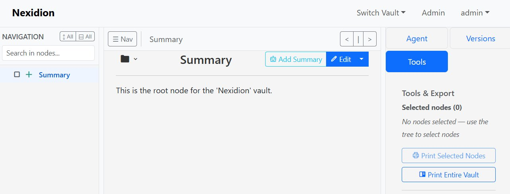
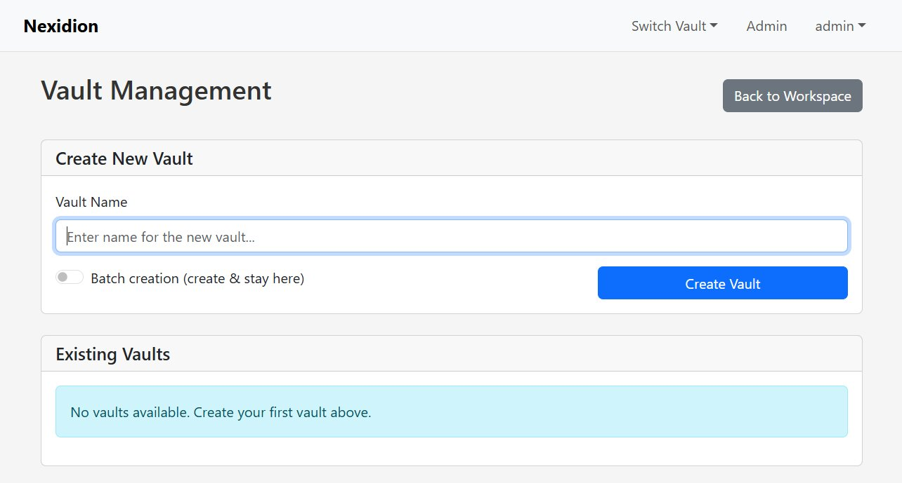

# Nexidion



> Nexidion is a private-first, self-hostable knowledge base for your most sensitive information. Self-host everything, trust no one.

This repository contains the full source code for the Nexidion application, including the Python/Flask backend, React frontend, and the optional AI task runner.

## 📖 Documentation

Before diving in, check out our dedicated user guides to get the most out of your vault:

*   **[User Manual & Getting Started](docs/manual.md)** - Installation, basic usage, and how to build your vault.
*   **[The Internal Link System](docs/links.md)** - How Nexidion's robust UUID-based linking keeps your knowledge connected, even when you rename things.
*   **[Navigation, Tools & Export](docs/tools.md)** - How to search, bulk-select, and export your vault.
*   **[Document Connectors](docs/connectors.md)** - How to import PDFs and organize ingested content.
*   **[AI Agent Setup & Usage Guide](docs/agent.md)** - How to configure and use the autonomous background Task Runner.
*   **[Bare-metal startup guide](docs/bare-metal.md)** - Install, update, and start the web server and Task Runner on Windows or Linux without Docker.

---

## The Mission: A Private Vault, Not Just a Second Brain

Nexidion was born from a personal need for a knowledge management tool where privacy is not a feature, but the core architectural principle. Many tools aim to be your "second brain," focusing on productivity and interconnectivity. Nexidion's goal is different: to be your **private vault**.

It was designed for managing highly sensitive information where trust in third-party services is not an option. Unlike cloud-based or sync-dependent applications, Nexidion is an open-source web application designed from the ground up to be self-hosted on your own server, under your absolute control. The entire system runs within your network. It is not a 'better Obsidian,' but a secure haven for your knowledge, accessible from any device with a web browser.

## Core Philosophy

*   **Privacy First:** Zero cloud-synchronization, zero telemetry, zero third-party tracking. Your data is yours alone.
*   **Total Control:** You run the software on your own hardware. You control access, backups, and any external connections.
*   **Verifiable Privacy:** The application is designed to have **zero external network calls by default**. Any connection to an external service (like an LLM API) is an explicit, opt-in configuration.
*   **Web-Based & Open Source:** Access your knowledge base from any modern web browser. The transparent, open-source code ensures there are no hidden surprises.

## Key Features

*   **Vaults (Multi-User):** Organize your knowledge into multiple, completely separate databases with strict access controls.
*   **Hierarchical Notes:** Structure your information in a familiar tree hierarchy.
*   **Rich Text Editing:** Write and format content using a clean Markdown editor.
*   **Full Version History:** Every change to a node is saved as a new version.
*   **Document Ingestion:** Import PDFs through a connector-based ingestion pipeline, with optional AI-assisted organization.
*   **Managed Image Assets:** Store imported images securely with provenance and access controls.
*   **Optional AI Agent Runner:** An autonomous background worker that can reorganize notes, summarize subtrees, or execute bulk changes based on your instructions.
*   **Robust Internal Linking:** A highly resilient UUID-based internal linking system that never breaks when renaming nodes.
*   **Secure Architecture:** Robust multi-user architecture using JWT for authentication, complete with an admin dashboard.



## How Nexidion Compares

There are hundreds of note-taking apps. Here is why Nexidion exists and where it fits in the ecosystem:

*   **Vs. Obsidian & Logseq:** Local markdown apps are fantastic, but syncing vaults across your PC, phone, and work laptop can be tedious (requiring paid sync services or complex Git/Syncthing setups). Nexidion is **server-first**. Host it securely on your home NAS or VPS, and access your vault from *any* web browser. Furthermore, Nexidion supports true multi-user isolation, whereas local apps are strictly single-user.
*   **Vs. Notion & Cloud Services:** Cloud workspaces require you to surrender your most sensitive data to third-party servers, where it may be subject to telemetry, lock-in, or AI scraping. Nexidion provides a modern, fluid workspace but enforces **100% data sovereignty**. You hold the database, you hold the keys.
*   **Vs. DokuWiki, MediaWiki & BookStack:** Traditional wikis are great for enterprise documentation, but they can feel rigid for personal thought-dumping. Nexidion offers a modern "second brain" architecture with highly resilient UUID-based linking (links never break when renaming) and a built-in **autonomous AI Task Runner** that works in the background to reorganize and summarize your notes—something traditional wikis do not have.

## Technical Architecture

*   **Backend:** Python, Flask, Gunicorn
*   **Database:** PostgreSQL 16-18 
*   **Frontend:** React.js, Vite (Served statically in production)
*   **Infrastructure:** Docker & Docker Compose

## Project Status (v4.3 Connector & Asset Update)

Nexidion 4.3 builds on the v4 multi-user architecture with connector-based document ingestion, AI-assisted curation, managed image assets, and richer provenance tracking. The optimized V2 state-loading API and integrated Task Runner continue to support responsive vault access and optional background AI operations.

---

## Getting Started (1-Command Install)

Nexidion is built to be deployed easily using Docker. 

**Prerequisites:**
*   Docker & Docker Compose installed on your host machine.

### 1. Clone the Repository
```bash
git clone https://github.com/HabermannR/Nexidion.git
cd Nexidion
```

### 2. Configure Environment
Copy the example environment file and fill in your secure credentials:
```bash
cp .env.example .env
```
Ensure you set your database passwords and the `JWT_SECRET_KEY` in the `.env` file.

### 3. Launch the App (Standard Mode)
To boot the database, run the automated migrations, create the default users, and start the web server, simply run:
```bash
docker compose --profile with-postgres up -d --build
```
The application will be built and accessible at `http://localhost:5001`. 

**Default Admin Login in dev** *(unless changed in `docker-compose.yml`)*:
*   **User:** `admin`
*   **Pass:** `defaultPassword123` *(Change this immediately in the UI!)*

### 4. Enable the AI Agent (Heavyweight Mode)


Nexidion includes a background Task Runner (`task_runner.py`) that acts as an autonomous editor. If you want to enable the AI agent, add your `OPENAI_API_KEY` to the `.env` file and launch using the full stack + Task Runner profile:

```bash
docker compose --profile with-postgres --profile with-task-runner up -d --force-recreate --build
```

*(Note: If you do not want to use the AI features, simply run the standard command in Step 3. The worker will remain offline, and no external requests will be made).*

## Configuration

The application is configured entirely via environment variables. Key options include:

*   `JWT_SECRET_KEY`: A strong, random secret for signing sessions.
*   `DB_USER` / `DB_PASSWORD` / `DB_NAME`: PostgreSQL credentials.
*   `ADMIN_PASSWORD`: Admin password for production environment.
*   `OPENAI_API_KEY`: API key for the optional Agent Runner (Requires enabling the worker profile).
*   `NEXIDION_POLL_INTERVAL`: How often the background worker checks for new tasks (default: 5s).

## Verifiable Privacy: Network Calls

As part of the "Privacy First" philosophy, Nexidion is designed to make **zero external network calls by default** after installation. All fonts, icons, and libraries are bundled directly into the Docker image.

The only external calls the application can make are **opt-in connections to Large Language Models (LLMs)** for the Agent Runner. Currently, the agent requires an OpenAI-compatible API to function. To maintain 100% data privacy, you can configure the backend to point to a locally-hosted LLM (e.g., via LM Studio, Ollama, or llama.cpp) by overriding the Local LLM URL in your configuration. This ensures that your sensitive documents and prompts never leave your local hardware.

---

### ⚠️ A Quick Note on the Frontend UI
If you do *not* boot up the worker, the AI Agent UI buttons will currently still appear in the frontend. Clicking them will simply create tasks in the database that sit in a `pending` status forever because no worker is running. 

If you didn't boot the worker profile, simply ignore the AI buttons for now.

---

## Deployment Scenarios & Commands

Depending on your existing infrastructure and whether you want the AI Task Runner, here are the commands to run Nexidion:

| Scenario | Command |
| :--- | :--- |
| **Full stack (default)** | `./start.sh up -d` *or* `docker compose --profile with-postgres up -d` |
| **Full stack + Task Runner** | `docker compose --profile with-postgres --profile with-task-runner up -d` |
| **Own Postgres, no Task Runner** | `docker compose up -d` |
| **Own Postgres + Task Runner** | `docker compose --profile with-task-runner up -d` |
