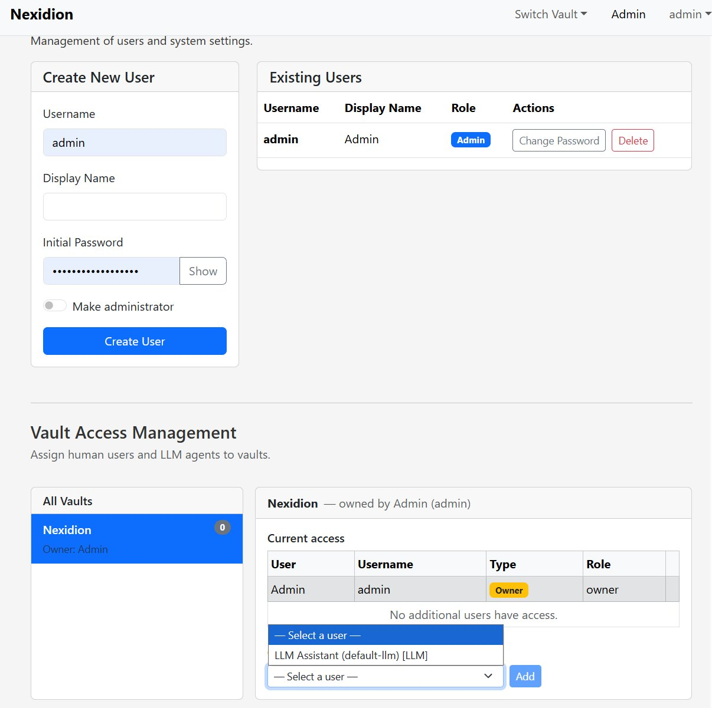
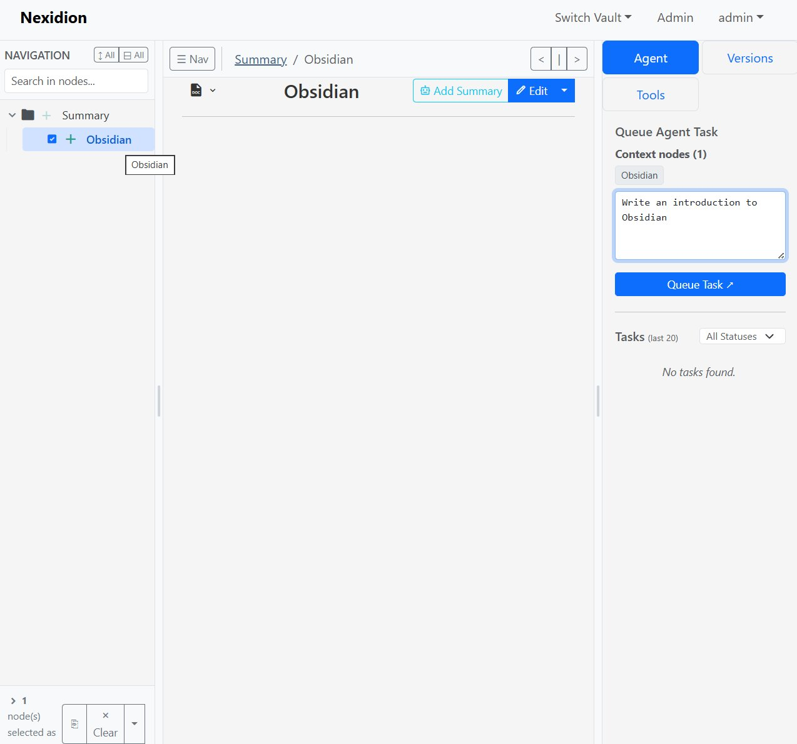
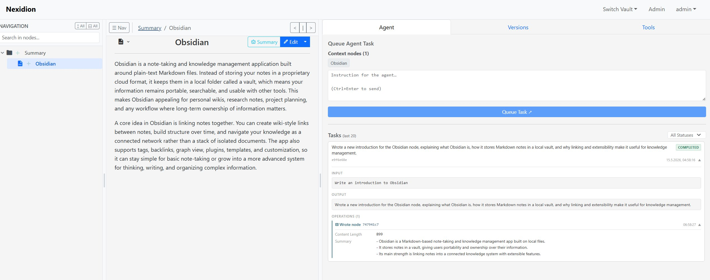
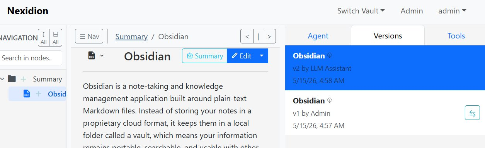
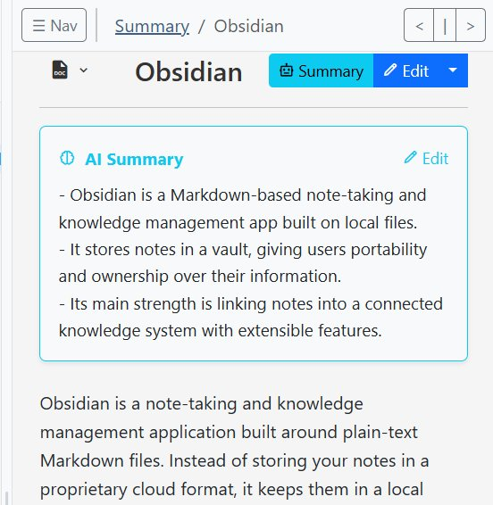
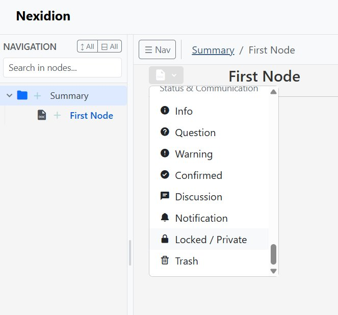

# Using the Nexidion AI Agent (Task Runner)

Nexidion includes an optional, autonomous background worker (the AI Task Runner) that can act as your personal knowledge assistant. Instead of just answering questions, this agent has "hands" — it can reorganize your notes, summarize subtrees, create new documents, or execute bulk changes based entirely on your natural language instructions.

> **⚠️ Prerequisite: The Task Runner must be running.**
> The AI Agent only works when Nexidion was launched with the `with-task-runner` Docker profile. If you started with the standard command, tasks you create will stay in a `pending` state forever — no worker is running to pick them up. To enable the agent, launch with:
> ```bash
> docker compose --profile with-postgres --profile with-task-runner up -d --force-recreate --build
> ```
> See the [README](../README.md) for all deployment scenarios.

## 1. Granting the Agent Access to Your Vault

The system automatically creates a special system user named **LLM Assistant** when you deploy Nexidion. However, for strict security, this assistant has zero access to your data by default.

Before you can issue tasks, you must invite the agent into your vault:

1. Click on your username in the **top right corner** and select **Admin** from the dropdown menu.
2. Scroll down to **Vault Access Management**.
3. Select your Vault on the left.
4. Under "Current access", select `LLM Assistant (default-llm) [LLM]` from the dropdown and click **Add**.



## 2. Issuing a Task to the Agent

Once the agent has access, navigate back to your workspace. Open the **Agent** tab on the right-hand panel.

### Step 1: Select Context (Optional but Recommended)
You can give the agent specific nodes to focus on by selecting them in the navigation tree on the left (hover over a node's icon and click the checkbox). The selected nodes will appear under "Context nodes" in the Agent panel.

### Step 2: Write Your Instruction
Write what you want the agent to do using plain natural language. You can ask it to:
*   *"Write an introduction to Obsidian."*
*   *"Summarize all the child nodes and put the summary in the parent node."*
*   *"Reorganize these selected nodes into folders based on topic."*
*   *"Read my meeting notes and extract a list of action items into a new node."*

### Step 3: Queue Task
Click **Queue Task**.



## 3. Reviewing the Agent's Work

By default, the background Task Runner checks for new tasks every 5 seconds (configurable via the `NEXIDION_POLL_INTERVAL` environment variable). Once it picks up your task, it will work autonomously in the background.

When finished, the task will show as **COMPLETED** in the task history list.

**Detailed Logs & Clickable Links:**
Click on a completed task to expand its details. The agent will present a written summary of exactly what it did and list the specific internal tools it used (e.g., `Wrote node`, `Moved node`).

All UUIDs listed in the operations log are **clickable links**. You can click right on the ID to instantly jump to the node the agent just created or modified!



## 4. Track Changes & AI Summaries

**Full Version Control:**
You never have to worry about the AI ruining your notes. Whenever the agent modifies a node, it creates a new version. In the **Versions** tab, you will clearly see edits attributed to the "LLM Assistant". If you don't like what the agent wrote, you can easily revert back to your previous human-written version.



**AI Summaries:**
The agent can also attach dedicated summary blocks to the top of nodes, giving you a quick TL;DR of large documents before you dive into reading them.



## 5. Protecting Sensitive Nodes

Nexidion gives you two levels of protection, selectable by changing a node's icon:

### Write-protected (bxs-lock-alt — "Locked")

The agent **cannot edit the content** of this node, but can still read it, update its AI summary, and move it. This is useful for nodes you want the agent to understand and reference, but not modify — like a master index or a pinned reference document.

### Fully private (bxs-no-entry — "Private")

The agent **cannot read or write** the content of this node at all. `get_node_content` and `get_node_summary` are blocked. The agent can still see the node's title and position in the tree, and can move it — but the body is completely opaque to the AI.

Use this for passwords, API keys, personal journal entries, or anything you absolutely do not want passing through the LLM.

**How to set it:** Click the node's icon to open the type selector and choose either **Locked** or **Private**.



> **Note on title visibility:** Both lock types still allow the agent to see the node's title and its location in the tree. If the title itself is sensitive, use a generic name.

---

## 6. Using a Local LLM for Full Privacy

By default, the Task Runner requires an OpenAI-compatible API key (`OPENAI_API_KEY` in your `.env` file). However, sending your notes to an external API defeats Nexidion's privacy-first philosophy.

To keep your data entirely on your own hardware, you can point the agent at a **locally-hosted LLM** instead — such as [Ollama](https://ollama.com), [LM Studio](https://lmstudio.ai), or [llama.cpp](https://github.com/ggerganov/llama.cpp). All of these expose an OpenAI-compatible API endpoint locally.

Override the API base URL in your `.env` file to point at your local server. For example, for Ollama running on the same machine:

```
OPENAI_BASE_URL=http://host.docker.internal:11434/v1
OPENAI_API_KEY=ollama
```

*(The key value is arbitrary when using Ollama or LM Studio — it just cannot be empty.)*

With a local LLM configured, **no data ever leaves your machine**. Your notes, prompts, and AI responses all stay within your own network.
