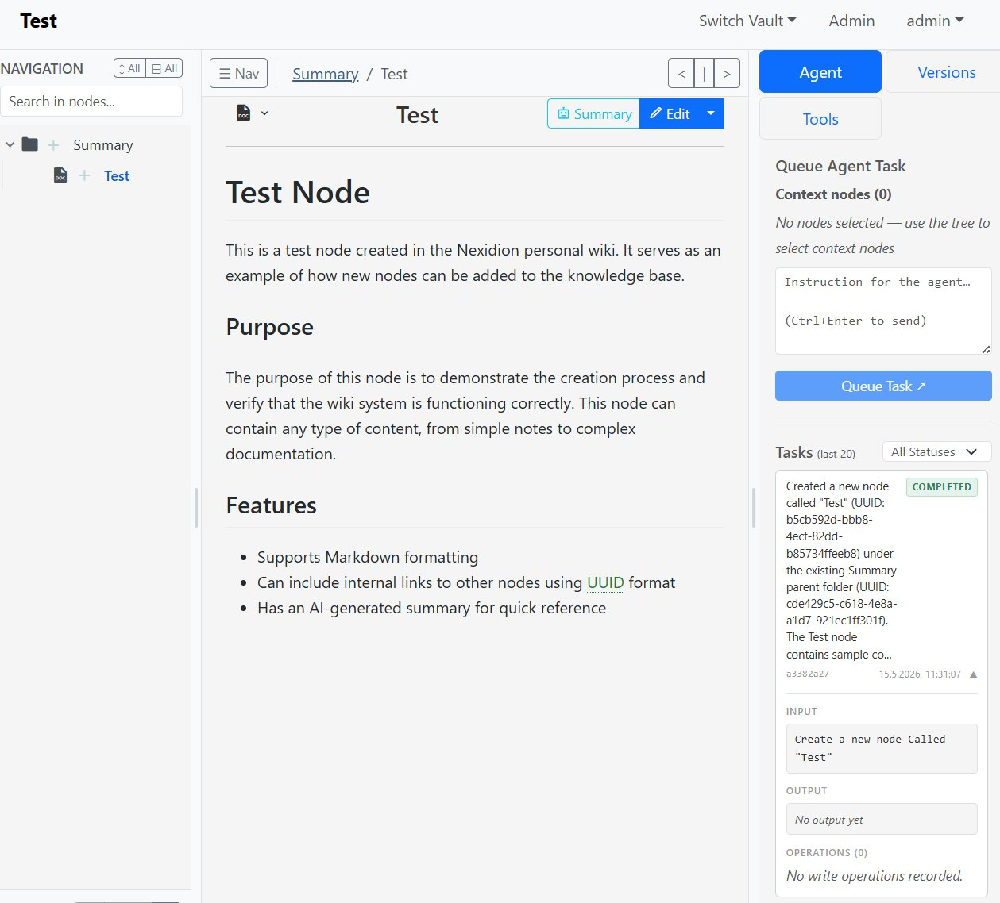

# Using the Nexidion AI Agent (Task Runner)

Nexidion includes an optional autonomous background worker (the AI Task Runner) for focused knowledge-maintenance actions. Open-ended AI conversation is handled through Nexidion's MCP integration; the workspace deliberately presents a small set of reviewable actions instead of a chat box.

> **⚠️ Prerequisite: The Task Runner must be running.**
> The AI Agent only works when Nexidion was launched with the `with-task-runner` Docker profile. If you started with the standard command, tasks you create will stay in a `pending` state forever — no worker is running to pick them up. To enable the agent, launch with:
> ```bash
> docker compose --profile with-postgres --profile with-task-runner up -d --force-recreate --build
> ```
> See the [README](../README.md) for all deployment scenarios.

## 1. Agent Access to a Vault

The system creates a special **LLM Assistant** account. New and imported vaults
grant this default assistant editor access automatically, so AI Actions work
without a separate trip through the administration page.

This is a one-time default, not an irrevocable permission. In **Admin → Vault
Access Management**, an administrator can remove the assistant, add a different
AI identity, or exclude AI identities entirely. A manually removed assistant is
not silently restored when somebody queues a task. The action instead fails with
a message explaining that AI access is disabled for the vault.

The access picker supports search and distinguishes human and AI accounts, which
keeps it usable when many users exist.


## 2. Running an AI Action

Once the agent has access, navigate back to your workspace. Open **AI Actions** in the right-hand panel.

### Step 1: Select Context
Select the nodes the action should operate on in the navigation tree on the left (hover over a node's icon and click the checkbox). The selected nodes appear at the top of the AI Actions panel. Actions stay disabled until at least one node is selected.

### Step 2: Choose an Action
Choose a configured provider and model first. The choice is stored with the
queued task, so changing the selector later cannot reroute work that is already
waiting. Provider credentials remain server-side and are never returned to the
browser.

Choose one of the bounded actions:

* **Roll up branch knowledge** treats each selected node as a destination root. Leaves are read-only source material. Nexidion rewrites every non-leaf descendant from its immediate children, deepest parent first, then finishes by rewriting the selected root. Each updated parent receives synthesized Markdown content and a three-bullet AI summary; titles, locations, structure, and leaves remain unchanged.
* **Refresh selected summaries** updates summaries for exactly the selected nodes, without traversing their children.
* **Improve unclear titles** reviews exactly the selected nodes and renames only titles that are demonstrably vague or misleading.

### Step 3: Review and Confirm
For a roll-up, the confirmation panel lists every parent note that would be
rewritten. All writable parents are preselected; clear individual checkboxes to
exclude them. Connector-managed parents are shown but disabled. Confirming queues
one tightly scoped job per included parent in a single batch request, deepest
parent first and each selected root last. Leaves are never queued for writing.


## 3. Reviewing the Agent's Work

By default, the background Task Runner checks for new tasks every 5 seconds (configurable via the `NEXIDION_POLL_INTERVAL` environment variable). Once it picks up your task, it will work autonomously in the background.

When finished, the task will show as **COMPLETED** in the task history list.

**Detailed Logs & Clickable Links:**
Click on a completed task to expand its details. The agent will present a written summary of exactly what it did and list the specific internal tools it used (e.g., `Wrote node`, `Moved node`).

All UUIDs listed in the operations log are **clickable links**. You can click right on the ID to instantly jump to the node the agent just created or modified!


### Roll-up write boundary

Each roll-up job may call `write_node` only for its one advertised destination
parent. The worker rejects every other write operation and every attempt to edit
another node. Before writing, it must fetch the full current Markdown of that
parent and each immediate child; summaries alone are not accepted as evidence.
It may read or search elsewhere in the same vault for context, but task tools are
always bound to the task vault and never read across vaults.

## 4. Track Changes & AI Summaries

**Full Version Control:**
You never have to worry about the AI ruining your notes. Whenever the agent modifies a node, it creates a new version. In the **Versions** tab, you will clearly see edits attributed to the "LLM Assistant". If you don't like what the agent wrote, you can easily revert to your previous human-written version.


**AI Summaries:**
The agent can also attach dedicated summary blocks to the top of nodes, giving you a quick TL;DR of large documents before you dive into reading them.


## 5. Protecting Sensitive Nodes

Nexidion gives you two levels of protection, selectable by changing a node's icon:

### Write-protected (bxs-lock-alt — "Locked")

The agent **cannot edit the content** of this node, but can still read it, update its AI summary, and move it. This is useful for nodes you want the agent to understand and reference, but not modify — like a master index or a pinned reference document.

### Fully private (bxs-no-entry — "Private")

The agent **cannot read or write** the content of this node at all. `get_node_content` and `get_node_summary` are blocked. The agent can still see the node's title and position in the tree, and can move it — but the body is completely opaque to the AI.

Use this for passwords, API keys, personal journal entries, or anything you absolutely do not want passing through the LLM.

**How to set it:** Click the node's icon to open the type selector and choose either **Locked** or **Private**.


> **Note on title visibility:** Both lock types still allow the agent to see the node's title and its location in the tree. If the title itself is sensitive, use a generic name.

---

## 6. Using a Local LLM for Full Privacy

By default, the Task Runner requires an OpenAI-compatible API key (`OPENAI_API_KEY` in your `.env` file). However, sending your notes to an external API defeats Nexidion's privacy-first philosophy.

To keep your data entirely on your own hardware, you can point the agent at a **locally-hosted LLM** instead — such as [Ollama](https://ollama.com), [LM Studio](https://lmstudio.ai), or [llama.cpp](https://github.com/ggerganov/llama.cpp). All of these expose an OpenAI-compatible API endpoint locally.

Set the local endpoint and model in your `.env` file. For example, for Ollama running on the Docker host:

```
DOCKER_LOCAL_LLM_URL=http://host.docker.internal:11434/v1
LOCAL_LLM_MODEL=llama3.1
LOCAL_LLM_API_KEY=not-needed
```

*(The key value is arbitrary when using Ollama or LM Studio — it just cannot be empty.)*

With a local LLM configured, **no data ever leaves your machine**. Your notes, prompts, and AI responses all stay within your own network.


## 7. Using OpenRouter

OpenRouter is available as a separate external provider. Configure it on the
server and restart the task runner:

```
OPENROUTER_API_KEY=your-key
OPENROUTER_MODEL=provider/model-slug
```

Optional `OPENROUTER_HTTP_REFERER` and `OPENROUTER_APP_TITLE` values are sent as
the recommended attribution headers. They are not required. The selected model
ID is recorded on each task; API keys and headers are not serialized with tasks
or exposed through `/api/system/config`.

AI Actions shows a curated list of up to ten OpenRouter models with live catalog
input/output prices per million tokens. Catalog data is fetched by the backend,
cached for five minutes, and falls back to model IDs when OpenRouter is
unreachable. Choose **Custom model…** to use any explicit OpenRouter model ID.
Deployments can override the list with comma-separated
`OPENROUTER_CURATED_MODELS` and the cache duration with
`OPENROUTER_CATALOG_CACHE_SECONDS`.

### Streaming diagnostics

The task runner consumes the Responses API as a stream and writes one JSONL trace
per task under `audit_logs/streams/<task-id>.jsonl`. By default only timestamps
and event types are stored. Set `NEXIDION_CAPTURE_STREAM_PAYLOADS=true` only for
local debugging because payloads can contain generated note content. Inspect a
trace with `python -m agent.stream_debug <task-id>` or follow a live trace with
`python -m agent.stream_debug <task-id> --follow`; add `--payloads` to display
captured payload data.

Network inactivity and absolute turn duration are configured separately with
`NEXIDION_LLM_REQUEST_TIMEOUT_SECONDS` and
`NEXIDION_LLM_HARD_TURN_TIMEOUT_SECONDS`. Reasoning effort is provider-default
unless `NEXIDION_REASONING_EFFORT` is explicitly set.
