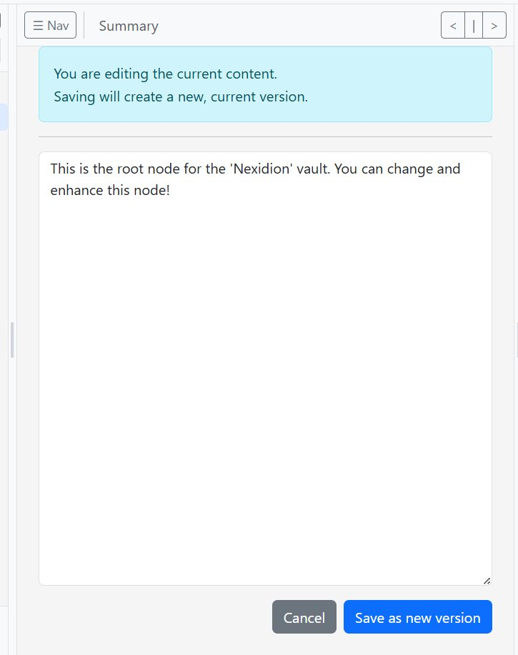

# Nexidion User Manual & Getting Started Guide

Welcome to Nexidion! This guide will walk you through the initial installation, account setup, and core concepts of your new private knowledge vault.

---

## 1. Installation & First Login

To get started, Nexidion is easily deployable via Docker.
Run the following command in your terminal where your `docker-compose.yml` is located:

```bash
docker compose --profile with-postgres up -d --build
```

Once the container is running, open your web browser and navigate to:
**[http://localhost:5001/](http://localhost:5001/)**

Log in using the default admin credentials. *(Note: By default, these are usually `admin` / `defaultPassword123` unless you changed them in your configuration).*

---

## 2. Create Your First Vault

When you first log in, you will be prompted to set up a Vault (a workspace).

1. Navigate to the Vault Management screen.
2. Enter a name for your new vault in the "Vault Name" field.
3. Click the **Create Vault** button.


---

## 3. Secure Your Account

Before you start adding sensitive data, you must change your default password.

1. Click on your username (`admin`) in the top right corner to open the dropdown menu.
2. Select **User Settings**.


3. In the User Settings screen, enter your current password, type your new secure password, and confirm it.
4. Click **Change Password**.


Once updated, click "Back to Workspace" or switch back to your vault via the top navigation menu.

---

## 4. Navigating the Interface & The Summary Node

When you open your vault, you will see the main interface. 

On the left-hand side, there is the navigation tree. By default, every vault has a pre-existing root node (usually named **Summary**). 
* **Note:** This root node cannot be deleted, as it acts as the foundation of your vault.
* **However, you can rename it!** Click the dropdown arrow next to the "Edit" button to access options like Rename, Print, or Delete (for non-root nodes).


---

## 5. Editing Nodes & Versioning

To add information to your vault, click the **Edit** button on any node.

1. Write your new content into the text area. 
2. When you are finished, click **Save as new version**.



**Version History:**
Every time you edit and save a node, Nexidion creates a completely new version rather than overwriting the old one. You can view, compare, or revert to past versions at any time by opening the **Versions** tab on the right side of the screen.


---

## 6. Adding & Selecting Nodes

Building your knowledge base is done by adding child nodes to the tree.

**Adding a Node:**
To add new nodes, click on the **green plus (`+`) icon** next to an existing node in the left-hand navigation tree. You can also choose an icon/type for your new node (Folder, Inbox, Document, etc.) and give it a name.


*Don't worry about picking the perfect name right away!* You can always rename a node later. Internal links in Nexidion stay perfectly intact even if you change titles, because the system links them securely using hidden **UUIDs** under the hood.

**Selecting Nodes for Batch Actions:**
If you want to perform bulk actions (like exporting or using tools on multiple nodes), you can select nodes directly from the tree.
Simply hover your mouse over a node's icon in the tree—it will turn into a checkbox. Click the checkbox to select it.


---
*Enjoy building your secure, private second brain with Nexidion!*


Here is the Todo list for your upcoming manual update, followed by some advice on how to balance the amount of information you include.

### 📝 Todo List for the Manual Update

**Navigation & Organization**
*   [ ] **Add "How to Search" section:** Briefly explain where the search bar is located and how it filters the node tree.
*   [ ] **Add "Moving & Reorganizing" section:** Explain the mechanism for moving nodes (e.g., drag-and-drop within the tree, or a "move to" menu option).
*   [ ] **Add "Deleting Nodes" section:** Clarify how to delete nodes properly, and mention what happens to child nodes if a parent is deleted.

**Content & Linking**
*   [ ] **Add "How to Create Internal Links" section:** Explain the actual steps/keystrokes required to link to another node inside the text editor. 
*   [ ] **Add "Link References & UUIDs" example:** Provide a quick, 1-sentence example showing why links don't break (e.g., *"If you link to a node called 'Project A' and later rename it to 'Completed Project', the link automatically updates because it's tracking the node's hidden ID, not its name."*).
*   [ ] **Clarify Node Types/Icons:** Add a small callout box explaining that node types (Folder, Inbox, Document) are purely cosmetic for your own organization—with the specific exception of the "Lock" icon, which protects the node from AI edits.

**Conclusion**
*   [ ] **Add "Next Steps" section:** Give the user 2-3 fun or useful things to do now that they know the basics (e.g., "Create a daily inbox," "Explore the optional AI Worker," or "Try exporting your vault").

