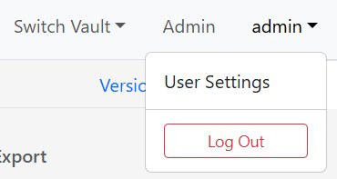
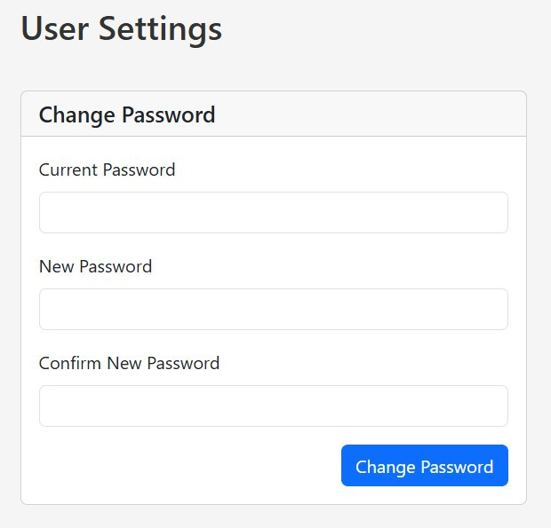
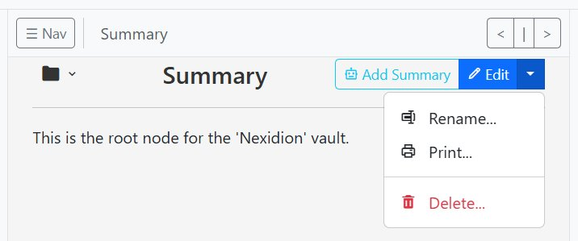
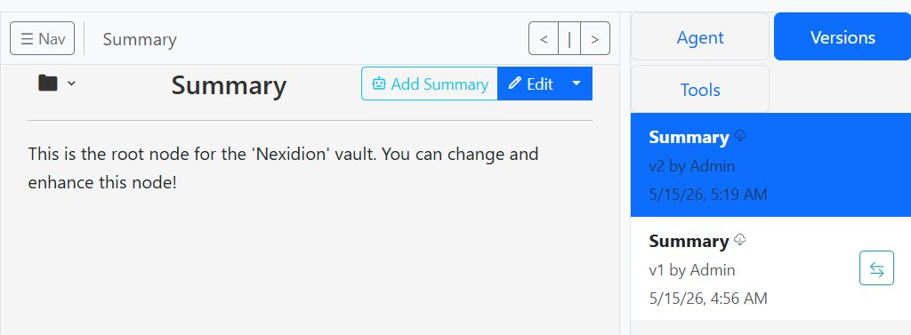
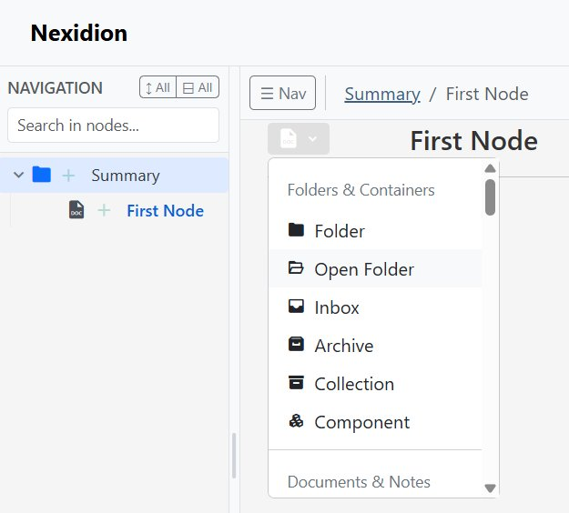
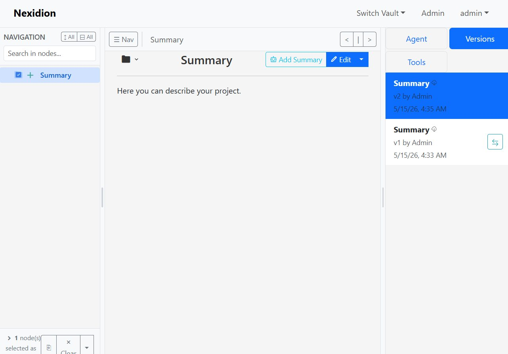

# Nexidion User Manual & Getting Started Guide

Welcome to Nexidion! This guide will walk you through the initial installation, account setup, and core concepts of your new private knowledge vault.

---

## 1. Installation & First Login

To get started, Nexidion is easily deployable via Docker.
Run the following command in your terminal where your `docker-compose.yml` is located:

```bash
docker compose --profile with-postgres up -d --force-recreate --build
```

Once the container is running, open your web browser and navigate to:
**[http://localhost:5001/](http://localhost:5001/)**

Log in using the default admin credentials:
*   **User:** `admin`
*   **Pass:** `defaultPassword123`

> **⚠️ Change this password immediately** before adding any data. See [Section 3](#3-secure-your-account) below.

---

## 2. Create Your First Vault

When you first log in, you will be prompted to set up a Vault (a workspace).

1. Navigate to the Vault Management screen.
2. Enter a name for your new vault in the "Vault Name" field.
3. Click the **Create Vault** button.


---

## 3. Secure Your Account

> **⚠️ Do this before storing any sensitive data.** The default password is public knowledge.

1. Click on your username (`admin`) in the top right corner to open the dropdown menu.
2. Select **User Settings**.



3. In the User Settings screen, enter your current password, type your new secure password, and confirm it.
4. Click **Change Password**.



Once updated, click "Back to Workspace" or switch back to your vault via the top navigation menu.

---

## 4. Navigation & Organization

When you open your vault, you will see the main interface.

### The Summary Node
On the left-hand side, there is the navigation tree. By default, every vault has a pre-existing root node (usually named **Summary**).
* **Note:** This root node cannot be deleted, as it acts as the foundation of your vault.
* **However, you can rename it!** Click the dropdown arrow next to the "Edit" button to access options like Rename, Print, or Delete (for non-root nodes).

### Searching
Directly above the navigation tree on the left, you will find the search bar. Nexidion uses **full-text search (FTS)** powered by PostgreSQL, supporting both **English and German** out of the box. Results are ranked by relevance using PostgreSQL's built-in text ranking, which weights matches by frequency and position. Typing keywords here will return the 20 highest-scoring matches. You can quickly cycle through these top results using the arrow buttons next to the search bar to instantly jump to specific notes.

### Moving & Reorganizing
Your knowledge base will grow over time, and you'll likely need to restructure it. You can move any node (and all of its child sub-nodes) to a new location in the tree. Simply drag and drop the node you want to move to its new parent node in the tree.

### Deleting Nodes
To delete a node, click the dropdown menu next to its "Edit" button and select **Delete**.

> **⚠️ Warning:** Deleting a node permanently destroys its content with no recycle bin. There is no undo. Child nodes are preserved — they move up one level in the hierarchy — but the deleted node's own content is gone. If you are unsure, consider locking or renaming the node instead.




---

## 5. Editing Nodes, Versioning & Internal Links

To add information to your vault, click the **Edit** button on any node. Write your new content into the text area, and when you are finished, click **Save as new version**.
You can also manually create and edit short summaries; even though this feature was designed for the AI agent, it is fully functional without any AI enabled.

### Creating Internal Links
Connecting your thoughts is easy with Nexidion's robust internal linking.

1. While typing in the editor, type `[[` followed by the name of the note you want to link to.
2. An autocomplete menu will pop up with search results.
3. Use your mouse to click, or use your arrow keys to select the note and press `Enter`.
4. The system will automatically insert a permanent link that looks like this: `[[Note Name|uuid-1234]]`.

**Why UUIDs?**
If you link to a node called 'Project A' and later rename it to 'Completed Project', the link automatically updates and doesn't break because Nexidion is tracking the node's hidden, permanent ID under the hood, not its name! *(For a deeper technical dive into how this works, see [The Internal Link System](links.md)).*

### Version History
Every time you edit and save a node, Nexidion creates a completely new version rather than overwriting the old one. You can view, compare, or revert to past versions at any time by opening the **Versions** tab on the right side of the screen.



---

## 6. Adding & Selecting Nodes

Building your knowledge base is done by adding child nodes to the tree.

**Adding a Node:**
To add new nodes, click on the **green plus (`+`) icon** next to an existing node in the left-hand navigation tree. You can also choose an icon/type for your new node and give it a name.

> **💡 Note on Node Types:**
> Icons like Folder, Inbox, or Document are entirely cosmetic and are just there to help you visually organize your tree.
> **Two icons are functional:**
> - **Lock** (`bxs-lock-alt`) — the AI agent cannot edit this node's content, but can still read it and update its summary.
> - **Private** (`bxs-no-entry`) — the AI agent cannot read or write this node's content at all, and it won't appear in agent search results.



**Selecting Nodes for Batch Actions:**
If you want to perform bulk actions (like exporting or using tools on multiple nodes), you can select nodes directly from the tree. Hover your mouse over a node's icon in the tree — it will turn into a checkbox. Click the checkbox to select it. To select multiple nodes, simply click the checkboxes on each node you want to include.



---

## 7. Using Images in Your Notes

Nexidion supports embedding images stored in a designated secure folder on the server. Unlike internal node links, images use standard Markdown syntax:

```markdown

```

**Setup:** A server administrator must define the `SECURE_IMAGE_FOLDER` path in the `.env` configuration file. Place image files directly into that folder — there is no upload UI at this time. Images are served through a JWT-authenticated endpoint, so they are only accessible to logged-in users.

> **Note:** This is different from the `[[...]]` internal link syntax used for nodes. Images always use the standard Markdown `` format with the `/api/image/` path prefix.

---

## 8. Next Steps

Now that you know the basics, here are a few things you can do to take full advantage of your vault:

*   **Create a Daily Inbox:** Create a node called "Inbox" to quickly dump your thoughts, links, and ideas before organizing them later.
*   **Explore the AI Assistant:** If you deployed Nexidion with the AI Worker profile, invite the LLM Assistant to your vault to help you reorganize notes and summarize documents. Read the [AI Agent Guide](agent.md) to learn how.
*   **Export Your Knowledge:** Want to backup your nodes to an offline PDF? Read the [Navigation, Tools & Export Guide](tools.md) to see how to extract your data.

*Enjoy building your secure, private second brain with Nexidion!*
